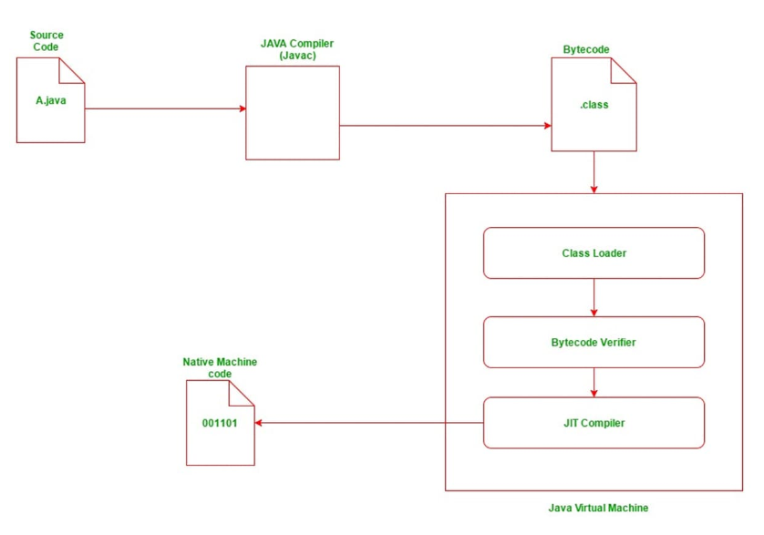
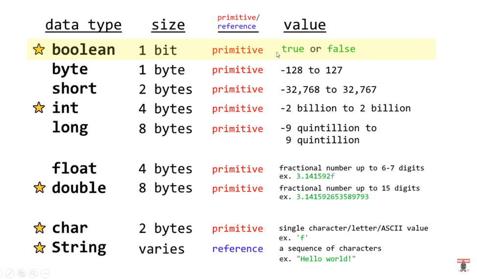
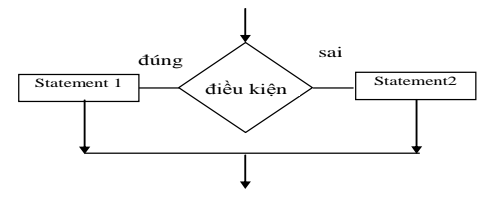

# Mục lục
- [Mục lục](#mục-lục)
- [Ngôn ngữ Java là gì](#ngôn-ngữ-java-là-gì)
- [Lí do ra đời của Java](#lí-do-ra-đời-của-java)
- [Cách Java hoạt động, điều gì xảy ra khi chạy code Java (.\\java)](#cách-java-hoạt-động-điều-gì-xảy-ra-khi-chạy-code-java-java)
- [Cấu trúc 1 chương trình Java](#cấu-trúc-1-chương-trình-java)
- [Package là gì](#package-là-gì)
- [Syntax cơ bản bao gồm:](#syntax-cơ-bản-bao-gồm)
- [Khai báo biến nguyên thủy](#khai-báo-biến-nguyên-thủy)
- [Làm quen với vòng lặp](#làm-quen-với-vòng-lặp)
- [Câu lệnh rẽ nhánh](#câu-lệnh-rẽ-nhánh)
- [Mảng trong Java](#mảng-trong-java)
- [Tổng quan về Object và Class](#tổng-quan-về-object-và-class)
  - [Ví dụ về class](#ví-dụ-về-class)
- [Từ khóa this, constructor, access modifier, getter, setter, từ khóa static](#từ-khóa-this-constructor-access-modifier-getter-setter-từ-khóa-static)
  - [1.constructor (hàm tạo)](#1constructor-hàm-tạo)
  - [2. Keyword this](#2-keyword-this)
  - [3. Access Modifier (private/public/protected)](#3-access-modifier-privatepublicprotected)
    - [Access modifier](#access-modifier)
  - [setter và getter](#setter-và-getter)
  - [static](#static)

# Ngôn ngữ Java là gì
**1. Lịch sử phát triển**
- Java là một trong những ngôn ngữ lập trình hướng đối tượng. Ngôn ngữ Java được sử dụng phổ biến trong phát triển phần mềm, trang web, game hay ứng dụng trên các thiết bị di động.

- Java được khởi đầu bởi James Gosling và bạn đồng nghiệp ở Sun MicroSystem năm 1991. Ban đầu Java được tạo ra nhằm mục đích viết phần mềm cho các sản phẩm gia dụng, và có tên là Oak. Java được chính thức phát hành năm 1994, đến năm 2010 được Oracle mua lại từ Sun MicroSystem.
# Lí do ra đời của Java
- Trong quá trình tạo ra một ngôn ngữ mới phục vụ cho mục đích chạy được trên nhiều nền tảng, các kỹ sư của Sun MicroSystem muốn tạo ra một ngôn ngữ dễ học và quen thuộc với đa số người lập trình. Vì vậy họ đã sử dụng lại các cú pháp của C và C++.

- Tuy nhiên, trong Java thao tác với con trỏ bị lược bỏ nhằm đảo bảo tính an toàn và dễ sử dụng hơn. Các thao tác overload, goto hay các cấu trúc như struct và union cũng được loại bỏ khỏi Java.
- **Write once, run anywhere** (Bạn viết code 1 lần, code của bạn có thể chạy trên nhiều  môi trường khác nhau, ví dụ windows, macos, linux...)
# Cách Java hoạt động, điều gì xảy ra khi chạy code Java (.\java)

1. File source code sau khi được sử dụng ngôn ngữ Java để viết mã.
2. Chạy file source code bằng trình biên dịch (compiler). Compiler sẽ kiểm tra lỗi, biên dịch sẽ hoàn tất nếu không có lỗi xảy ra.
3. Compiler tạo ra file mới, được mã hóa thành Java bytecode. Bất kì thiết bị nào có khả năng chạy Java đều có thể thông dịch (interpret) file này sang thứ gì đó mà nó có thể chạy.
4. Các thiết bị được cài đặt máy ảo Java (JVM – Java virtual machine). Khi các thiết bị chạy game, JVM sẽ đọc và chạy các file bytecode.
# Cấu trúc 1 chương trình Java
```java
package <package_name>;

import <other_package>;

public class ClassName {
  <Variables (also known as fields)>;

  <constructor method(s)>;

  <other methods>;
}
  ```

  #  Package là gì
  -**Package**: Một package (gói) mô tả không gian tên có chứa các lớp của Java, sử dụng ký tự thường và dấu chấm để định nghĩa tên, chúng ta có thể xem package như là một thư mục, còn class chính là các file trực thuộc thư mục.
 - Keyword import:
   + được sử dụng để import (tái sử dụng lại) các class đã được định nghĩa trong các package
  #  Syntax cơ bản bao gồm:
  ```java
  //1 chương trình cơ bản
  import java.util.Scanner;//Thư viện nhập
  public class Main {
  public static void main(String[] args) {
    //Shortcut : sysout + clrt + space + enter
    System.out.println("Hello World"); // Xuất
    //Nhập
    Scanner scanner = new Scanner(System.in);// Khai bao 1 object kiểu Scanner
    //Nhập số nguyên
    int a = scanner.nextInt();
    //Nhập kí tự
    char c = scanner.next()
    //Syntax
    type tên_biến = scanner.nextType();
  }
}

  ```

  #  Khai báo biến nguyên thủy

  ```java
  //Syntax:
   type variable = value;
  //Example
  int a = 5; // Biến kiểu số nguyên
  char c = 'c'; //Biến kiểu kí tự
  long  b = 100000;//Biến kiểu số nguyên (>int)
  String e = "Long";//Biến kiểu xâu
```
  
  #  Làm quen với vòng lặp
```java
//Syntax
//While
while (condition) {
  // code block to be executed
}
//For
for (statement 1; statement 2; statement 3) {
  // code block to be executed
}
//Example
for(int i = 1 ; i <= 100; i++)
System.out.println("ProPTIT");
//=> In ra 100 dòng ProPTIT
```
  #  Câu lệnh rẽ nhánh
  
  - Java If...Else
  ```java
  //Syntax
if (điều kiện 1) {
  câu lệnh 1;
  câu lệnh 2;
  ...
} else if (điều kiện 2) {
  câu lệnh 1;
  câu lệnh 2;
  ...
} else {
  câu lệnh 1;
  câu lệnh 2;
  ...
}
```
- Java Switch
```java
- Keyword: break; default
switch(expression) {
case x:
// code block
break;
case y:
// code block
break;
default:
// code block
}
```
  #  Mảng trong Java
 
 - Định nghĩa: Array là cách chúng ta lưu trữ "nhiều giá trị" bên trong 1 biến duy nhất (store
multiple values in single variable)
=> không tốn công khai báo nhiều lần.
Để định nghĩa array, khai báo "type" và cặp dấu đóng/mở ngoặc vuông (square
brackets).
Chiều dài (length) của array được tạo ra khi gán giá trị cho array
  - Cách khai báo mảng 1 chiều
   ```java
   //Syntax 
    //c1
   int[] a;
   int b[];
  //c2
  int[] b = new int[10];
   // khởi tạo mảng nặc danh
int[] c = {1, 2, 3, 4, 5};
// khởi tạo mảng bằng vòng lặp for
int[] b = new int[10];
for (int i = 0; i < 10; i++) {
    b[i] = i;
}
   ```
   - Cách khai báo mảng 2 chiều
   ```java
   //C1
  int[][] a = null;
  int b[][] = null;
  //C2
  int c[][] = new int[4][];
  // khai báo và khởi tạo mảng 2 chiều nặc danh
int[][] c = {{1, 2}, { 3, 4}, { 3, 4}, { 3, 4}};
// khởi tạo mảng 2 chiều bằng vòng lặp for
int[][] b = new int[4][2];
for (int i = 0; i < 4; i++) {
    for (int j = 0; j < 2; j++) {
        b[i][j] = i;
    }
}
   ```
   - Ví dụ nhập mảng từ bàn phím trong java
```java
package vn.viettuts.array;
 
import java.util.Scanner;
 
public class ArrayExample1 {
    public static Scanner scanner = new Scanner(System.in);
 
    /**
     * main
     * 
     * @param args
     */
    public static void main(String[] args) {
        System.out.print("Nhập số phần tử của mảng: ");
        int n = scanner.nextInt();
        // khởi tạo mảng arr
        int[] arr = new int[n];
        System.out.print("Nhập các phần tử của mảng: \n");
        for (int i = 0; i < n; i++) {
            System.out.printf("a[%d] = ", i);
            arr[i] = scanner.nextInt();
        }
        System.out.print("Các phần tử của mảng: ");
        show(arr);
    }
 
    /**
     * in các phần tử của mảng ra màn hình
     * 
     * @param arr: mảng các số nguyên
     * @param n: số phần tử của mảng
     */
    public static void show(int[] arr) {
        for (int i = 0; i < arr.length; i++) {
            System.out.print(arr[i] + " ");
        }
    }
}
```
```
Nhập số phần tử của mảng: 10
a[0] = 1
a[1] = 2
a[2] = 3
a[3] = 4
a[4] = 5
a[5] = 6
a[6] = 7
a[7] = 8
a[8] = 9
a[9] = 10
Các phần tử của mảng: 1 2 3 4 5 6 7 8 9 10 
```
- Từ khóa **break **và **continue**
  - **break**
```java
int i = 0;
while (i < 10) {
  System.out.println(i);
  i++;
  if (i == 4) {
    //Vòng lặp sẽ bị dừng khi chạy đến i == 4
    break;
  }
}
```
  -  **continue**
```java
int i = 0;
while (i < 10) {
  //Khi chạy đến i == 4 thì sẽ bỏ qua câu lệnh các câu lệnh dưới
  if (i == 4) {
    i++;
    continue;
  }
  System.out.println(i);
  i++;
}
```

# Tổng quan về Object và Class
Để mô phỏng "real wold", chúng ta cần các "đối tượng" (target)
Đối với 1 sinh vật/đồ vật trong thế giới thực, đều có thể miêu tả bởi 2 thứ
- Đặc điểm (thuộc tính)
- Hành vi đặc trưng của nó
VD: Miêu tả 1 cái máy tính (đồ vật)
-Đặc điểm:
+có dung lượng ổ cứng (SSD/HDD)
+có dung lượng bộ nhớ (RAM)
-Hành vi:
+Có thể on/off

=>Sử dụng "đối tượng" để mô hình hóa
Tuy nhiên, chúng ta không "miêu tả chi tiết", chỉ miêu tả "đối tượng tổng quát"(đây gọi
là **tính trừu tượng hóa/abstraction**)
- Khái niệm:
   - **Class** chính là "đối tượng tổng quát" của real-word được mô phỏng
   - **Object** là các thực tể chi tiết của class đấy
 ## Ví dụ về class
 ```java
 public class Student {
String name;
int age;
}
```
- Làm sao để tạo ra các đối tượng Student cụ thể:
```java
public static void main(String[] args) {
Student a = new Student();
a.age = 19;
a.name = "Long";
System.out.println("Student a with name = " + a.name + " and age = " + a.age);
}
```
Ở block code trên thì:
- Student là tên Class:
   - a là Object, một "đối tượng" chi tiết của class Student (instance) /1 bản thể/ 1 bản sao
   - a được tạo ra thông qua keyword "new" => có thể tạo ra bao nhiêu đối tượng tùy thích (từ 1 class ban đầu)
   - a được gán giá trị thông qua "dot.attribute"
# Từ khóa this, constructor, access modifier, getter, setter, từ khóa static
## 1.constructor (hàm tạo)
Hàm tạo là một "method đặc biệt" dùng để tạo ra object
 - Constructor "phải có tên giống với class", và không thể có "return type" 
 - Tất cả các class đều cần có "hàm tạo". Nếu bạn không tạo => java sẽ tự động tạo cho 
bạn (không có tham số đầu vào) 
Ví dụ: 
```java
public Student (String name, int age){ 
this.name = name; 
this.age = age; 
} 
```
## 2. Keyword this
 - Dùng để "tham chiếu" tới giá trị của instance/object hiện tại (tương tự con trỏ của C :v) 
//tạo mới object với hàm tạo  
## 3. Access Modifier (private/public/protected)
Ta chia modifiers thành 2 loại:

- **Access Modifiers** - kiểm soát mức độ sửa đổi
- **Non-Access Modifiers** - không kiểm soát mức độ sửa đổi, nhưng cung cấp những functionality khác

### Access modifier
- Đối với class:

| Modifier | Description                                                                                                             |
| -------- | ----------------------------------------------------------------------------------------------------------------------- |
| public   | The class có thể được truy cập bởi class khác                                                                           |
| default  | The class chỉ có thể được truy cập bởi class khác ở trong cùng package. Điều này được sử dụng khi không cần sửa đổi gì. |

- Đối với các attributes, methods and constructors:

| Modifier  | Description                                                     |
| --------- | --------------------------------------------------------------- |
| public    | Code có thể được truy cập bởi tất cả classes                    |
| private   | Code chỉ có thể được truy cập bởi class được khai báo           |
| default   | Code  chỉ có thể được truy cập trong cùng package               |
| protected | Code chỉ có thể được truy cập trong cùng package và subclasses. |


## setter và getter
-  **setter** : là method trả về dữ liệu của 1 đối tượng trong class
-  **getter** : là method truyền dữ liệu của 1 đối tượng trong class
-  Shortcut : shift + ins = > getter , setter
```java
public class SinhVien {
    String name;

    //Tra ve du lieu
    public String getName() {
        return name;
    }
    //Truyen du lieu vao
    public void setName(String name) {
        this.name = name;
    }
}
```
## static
- Định nghĩa : The static keyword is a non-access modifier used for methods and attributes. Static methods/attributes can be accessed without creating an object of a class.

